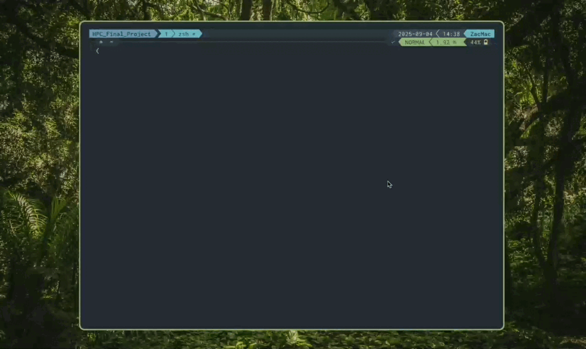

# Tmux SSHX

A fuzzy SSH host and tmux window selector for Tmux, with preview capabilities. Shows tmux windows that match SSH host names first (blue ), then SSH hosts as new configs (yellow ).



> [!WARNING]
> Much of this is generated by AI it is just a tool I use for myself
> If anybody wants to improve it pls do so

## Prerequisites 🛠️

- [tpm](https://github.com/tmux-plugins/tpm)
- [fzf](https://github.com/junegunn/fzf) (version 0.53.0+ recommended for built-in tmux support)
- Optional: [bat](https://github.com/sharkdp/bat) for syntax highlighting in preview

### Installing Prerequisites

#### macOS (with Homebrew)

```bash
brew install tmux fzf bat
# TPM is installed via git clone in the manual section
```

**Note**: `bat` is used for syntax highlighting in the preview pane with SSH config syntax highlighting. If bat is not available, the preview will still work but without colors.

#### Ubuntu/Debian

```bash
sudo apt update
sudo apt install tmux fzf bat
# Install TPM manually (if not available in repos)
git clone https://github.com/tmux-plugins/tpm ~/.tmux/plugins/tpm
```

#### Arch Linux

```bash
sudo pacman -S tmux fzf bat
# tmux-plugin-manager is available in AUR if needed
```

#### Manual Installation

- **Tmux**: Download from https://github.com/tmux/tmux/releases
- **TPM**: `git clone https://github.com/tmux-plugins/tpm ~/.tmux/plugins/tpm`
- **fzf**: Download from https://github.com/junegunn/fzf/releases (get the latest version for tmux support)
- **bat**: Download from https://github.com/sharkdp/bat/releases

## Install 💻

### Option 1: Using TPM (Recommended)

1. Add this to your `.tmux.conf`:
   ```
   set -g @plugin 'jac-zac/tmux-sshx'
   ```
2. Install the plugin: Press `Ctrl-I` (or run `~/.tmux/plugins/tpm/bin/install_plugins`)

## Configure ⚙️

The default binding for this plugin is `<prefix>+S`. You can change it by adding this line with your desired key:

```sh
set -g @sshx-bind '<mykey>'
```

### Additional configuration options:

```sh
# By default, tmux `<prefix>` key needs to pressed before `<mykey>` to launch
# sshx. In case you just want to bind '<mykey>' without the tmux '<prefix>'
# add the following line to turn the prefix off. This option is set to
# on by defaut.
set -g @sshx-prefix off

# Change window dimensions
set -g @sshx-window-height '65%'
set -g @sshx-window-width '70%'

# Layout options: 'default' (bottom) or 'reverse' (top)
set -g @sshx-layout 'default'

# If you want to change the prompt, the space is needed to not overlap the icon
set -g @sshx-prompt " "

# If you want to change the pointer
set -g @sshx-pointer "▶ "

# The window displays "tmux-sshx" as the border label at the top
# This helps identify the window when multiple are open

# Preview location and screenspace can be adjusted with these
set -g @sshx-preview-location 'right'
set -g @sshx-preview-ratio '55%'

# The preview can also be disabled altogether
set -g @sshx-preview-enabled 'false'

# If you want to pass in your own FZF options. This is passed in before all other
# arguments to FZF to ensure that other options like `@sshx-pointer` and
# `@sshx-window-height/width` still work. See `man fzf` for config options.
set -g @sshx-additional-options "--color pointer:9,spinner:92,marker:46"

# When set to 'on' auto-accept will interactively accept a host
# when there's only one match
set -g @sshx-auto-accept 'off'

# Uses \`fzf --tmux\` instead of the \`fzf-tmux\` script (requires fzf >= 0.53).
# Set to 'on' if you have fzf 0.53+ and want to use built-in tmux support
set -g @sshx-fzf-builtin-tmux 'off'

# Customize key bindings within the fuzzy finder
set -g @sshx-bind-abort 'esc'
set -g @sshx-bind-accept 'enter'
set -g @sshx-bind-scroll-up 'ctrl-u'
set -g @sshx-bind-scroll-down 'ctrl-d'
set -g @sshx-bind-select-up 'ctrl-n'
set -g @sshx-bind-select-down 'ctrl-p'
```

## Working with SSHX 👷

Launching the plugin opens a fuzzy finder with tmux windows that match SSH host names first (blue ), followed by SSH hosts as new configs (yellow ). The preview pane shows details for the selected item.

**Key Bindings:**
- `enter` - Accept selection and connect/attach
- `esc` - Abort without connecting
- `ctrl-a` - Show all items (tmux windows + SSH configs)
- `ctrl-t` - Filter to show only matching tmux windows
- `ctrl-h` - Filter to show only SSH configs
- `tab` - Move down in list
- `shift-tab` - Move up in list
- `ctrl-u` - Scroll preview up
- `ctrl-d` - Scroll preview down
- `?` - Toggle preview pane

**Selection Behavior:**
- **Tmux Window (blue )**: Switches to the selected tmux window
- **SSH Host (yellow )**: Opens SSH connection in new tmux window (if in tmux) or directly in terminal

**Note**: If the popup appears empty, check that:
- You have tmux windows with names matching your SSH hosts, or
- `~/.ssh/config` exists and contains `Host` entries
- Your SSH config has valid host definitions
- The file is readable (run `ls -la ~/.ssh/config`)
- The file has correct permissions (run `chmod 600 ~/.ssh/config` if needed)

## Troubleshooting 🔧

### Empty Popup

If the fuzzy finder appears but is empty:

1. Check if `~/.ssh/config` exists: `ls -la ~/.ssh/config`
2. Verify it contains Host entries: `grep "^Host " ~/.ssh/config`
3. Ensure the file is readable: `cat ~/.ssh/config`
4. Try creating a basic config if none exists:
   ```
   Host example
       HostName example.com
       User youruser
   ```

### Permission Issues

If you get permission errors:

```bash
chmod 600 ~/.ssh/config
```

### Preview Not Working

- Install `bat` for syntax highlighting: `brew install bat` (macOS) or `sudo apt install bat` (Ubuntu)
- Or the preview will still work but without colors

## Thanks ❤️

Inspired by [tmux-sessionx](https://github.com/omerxx/tmux-sessionx).
